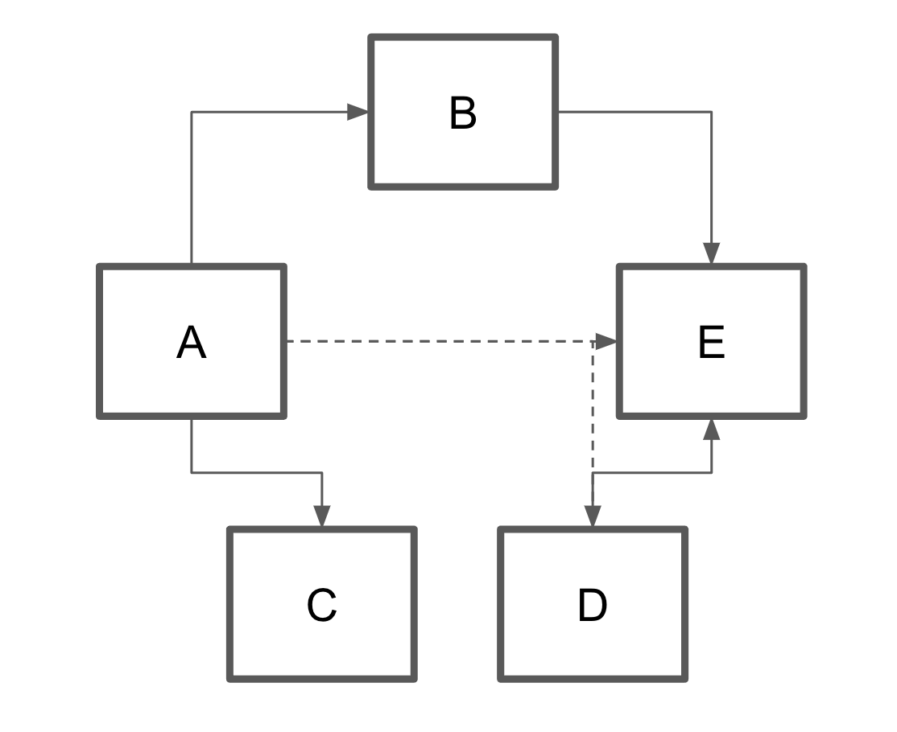
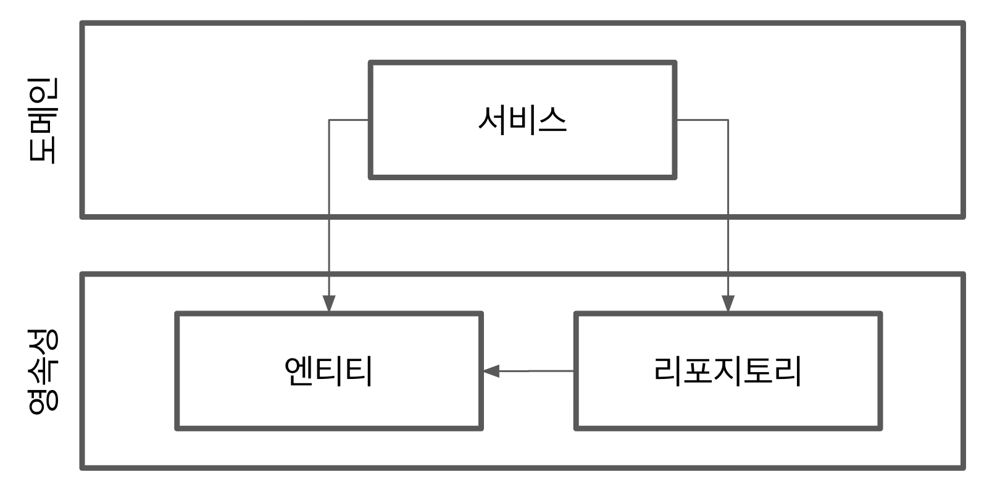
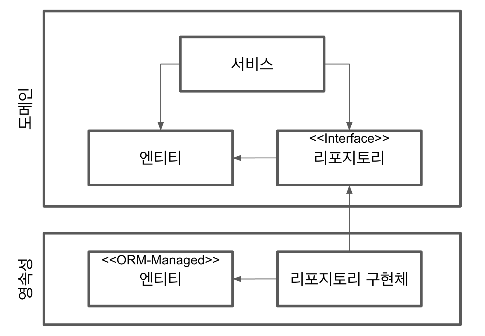
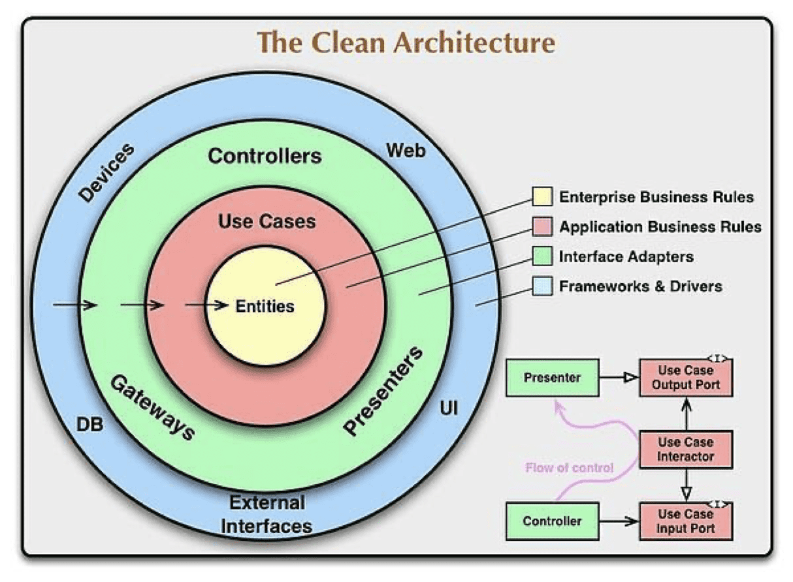
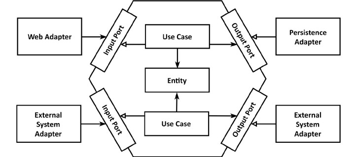

이번 장에서는 계층형 아키텍처의 대안에 대해 이야기 해보자. 먼저 단일 책임 원칙(Single Responsibility Principle, SRP)과 의존성 역전 원칙(Dependency Inversion Principle, DIP)에 대해 이야기하는 것으로 시작하자.

## 단일 책임 원칙

이 원칙의 일반적인 해석은 다음과 같다.

> 하나의 컴폰넌트는 오로지 한 가지 일만 해야하고, 그것을 올바르게 수행해야 한다.

이는 단일 책임 원칙의 실제 의도는 아니다.

단일 책임 원칙의 실제 정의는 다음과 같다.

> 컴포넌트를 변경하는 이유는 오직 하나뿐이어야 한다.

만약 컴포넌트를 변경할 이유가 한 가지라면 우리가 **어떤 다른 이유로** 소프트웨어를 변경하더라도 이 컴포넌트에 대해서는 전혀 신경 쓸 필요가 없다. 소프트웨어가 변경되더라도 여전히 우리가 기대한 대로 동작할 것이기 때문이다.

안타깝게도 변경할 이유라는 것은 컴포넌트 간의 의존성을 통해 너무도 쉽게 전파된다.



```
어떤 컴포넌트의 의존성 각각은 이 컴포넌트를 변경하는 이유 하나씩에 해당한다. 점선 화살표처럼 전이 의존성(transitive dependency) 이라고 하더라도 말이다.

> 전의 의존성: 프로그램이 참조하고 있는 컴포넌트로부터 전이된 의존성

```

컴포넌트 A는 여러 컴포넌트에 의존하는 반면 E는 의존하는 것이 없다.

컴포넌트 E를 변경할 유일한 이유는 새로운 요구사항에 의해 E의 기능을 바꿔야 할 때 뿐이다. A의 경우 어떤 컴포넌트가 바뀌든 같이 바뀌어야 한다.

## 의존성 역전 원칙

계층형 아키텍처에서 계층 간 의존성은 항상 다음 계층인 아래 방향을 가리킨다. 단일 책임 원칙을 고수준에서 적용할 때 상위 계층들이 하위 계층들에 비해 변경할 이유가 더 많다는 것을 알 수 있다.

그러므로 영속성 계층을 변경할 때마다 잠재적으로 도메인 계층도 변경해야 한다.

이 의존성을 어떻게 제거할 수 있을까?

의존성 역전 원칙이 답을 알려준다.

> 코드상의 어떤 의존성이든 그 방향을 바꿀 수(역전시킬 수) 있다.

사실 의존성의 양쪽 코드를 모두 제어할 수 있을 때만 의존성을 역전시킬 수 있다. 만약 서드파티 라이브러리에 의존성이 있다면 해당 라이브러리를 제어할 수 없기 때문에 이 의존성을 역전시킬 수 없다.



도메인 계층에 영속성 계층의 엔티티와 리포지토리와 상호작용하는 서비스가 하나 있다.

엔티티는 도메인 객체를 표현하고 도메인 코드는 이 엔티티들의 상태를 변경하는 일을 중심으로 하기 때문에 먼저 엔티티를 도메인 계층으로 올린다.

이제 영속성 계층의 리포지토리가 도메인 계층에 있는 엔티티에 의존하기 때문에 두 계층 사이에 순한 의존성(circular dependency)이 생긴다. 이 부분이 바로 DIP를 적용하는 부분이다. 도메인 계층에 리포지토리에 대한 인터페이스를 만들고, 실제 리포지토리는 영속성 계층에서 구현하게 하는 것이다.



```

도메인 계층에 인터페이스를 도입함으로써 의존성을 역전시킬 수 있고, 그 덕분에 영속성 계층이 도메인 계층에 의존하게 된다.

```

이로써 영속성 코드에 있는 의존성으로부터 도메인 로직을 해방시켰다.

## 클린 아키텍처

로버트 C. 마틴은 '클린 아키텍처'에서는 설계가 비즈니스 규칙의 테스트를 용이하게 하고, 비즈니스 규칙은 프레임워크, 데이터베이스, UI 기술, 그 밖의 외부 애플리케이션이나 인터페이스로부터 독립적일 수 있다고 이야기 했다.

이는 도메인 코드가 밖으로 향하는 어떤 의존성도 없어야 함을 의미했다. 대신 의존성 역전 원칙의 도움으로 모든 의존성이 도메인 코드를 향하고 있다.



```
클린 아키텍처에서 모든 의존성은 도메인 로직을 향해 안쪽 방향으로 향한다.
```

이 아키텍처에서 가장 중요한 규칙은 의존성 규칙으로, 계층 간의 모든 의존성이 안쪽으로 향해야 한다는 것이다.

코어에는 주변 유스케이스에서 접근하는 도메인 엔티티들이 있다. 유스케이스는 단일 책임을 갖기 위해 조금 더 세분화돼 있다. 이전에 이야기했던 **넓은 서비스** 문제를 피할 수 있다.

도메인 코드에서는 어떤 영속성 프레임워크나 UI 프레임워크가 사용되는지 알 수 없기 때문에 특정 프레임워크에 특화된 코드를 가질 수 없고 비즈니스 규칙에 집중할 수 있다. 그래서 도메인 코드를 자유롭게 모델링 할 수 있다.
영속성이나 UI에 특화된 문제를 신경 쓰지 않아도 된다면 이렇게 하기가 굉장히 수월해진다.

그러나 클린 아키텍처에는 대가가 따른다. 도메인 계층이 영속성이나 UI같은 외부 계층과 철저하게 분리돼야 하므로 애플리케이션의 엔티티에 대한 모델을 각 계층에서 유지보수해야 한다.

하지만 도메인 코드를 프레임워크에 특화된 문제로부터 해방시키고 결합이 제거된다.

클린 아키텍처는 다소 추상적이기 때문에 조금 더 깊게 들어가서 클린 아키텍처의 원칙들을 조금 더 구체적으로 만들어주는 '육각형 아키텍처'에 대해 살펴보자.

## 육각형 아키텍처(헥사고날 아키텍처)

'육각형 아키텍처'라는 용어는 알리스테어 콕번이 만든 용어다.



```
육각형 아키텍처는 애플리케이션 코어가 각 어댑터와 상호작용하기 위해 특정 포트를 제공하기 때문에 '포트와 어댑터'(ports-and-adapters) 아키텍처라고도 불린다.
```

육각형 안에는 도메인 엔티티와 이와 상호작용하는 유스케이스가 있다. 육각형에서 외부로 향하는 의존성이 없기 때문에 마틴이 클린 아키텍처에서 제시한 의존성 규칙이 그대로 적용된다는 점을 주목하자. 대신 모든 의존성은 코어를 향한다.

왼쪽에 있는 어댑터들은 (애플리케이션 코어를 호출하기 때문에) 애플리케이션을 주도하는 어댑터들이다. 반면 오른쪽에 있는 어댑터들은 (애플리케이션 코어에 의해 호출되기 때문에) 애플리케이션에 의해 주도되는 어댑터들이다.

애플리케이션 코어와 어댑터들 간의 통신이 가능하려면 애플리케이션 코어가 각각의 포트를 제공해야 한다. 주도하는 어댑터(driving adapter)에게는 그러한 포트가 코어에 있는 유스케이스 클래스들에 의해 구현되고 호출되는 인터페이스가 될 것이고, 주도되는 어댑터(driven adapter)에게는 그러한 포트가 어댑터에 의해 구현되고 코어에 의해 호출되는 인터페이스가 될 것이다.

클린 아키텍처처럼 육각형 아키텍처도 계층으로 구성할 수 있다. 가장 바깥쪽에 있는 계층은 애플리케이션과 다른 시스템 간의 번역을 담당하는 어댑터로 구성돼 있다. 다음으로 포트와 유스케이스 구현체를 결합해서 애플리케이션 계층을 구성할 수 있는데, 이 두 가지가 애플리케이션의 인터페이스를 정의하기 때문이다. 마지막 계층에는 도메인 엔티티가 위치한다.

## 유지보수 가능한 소프트웨어를 만드는 데 어떻게 도움이 될까?

클린 아키텍처, 육각형 아키텍처 모두 의존성을 역전시켜 도메인 코드가 다른 바깥쪽 코드에 의존하지 않게 함으로써 영속성과 UI에 특화된 모든 문제로부터 도메인 로직의 결합을 제거하고 코드를 변경할 이유의 수를 줄일 수 있다. 그리고 변경할 이유가 적을수록 유지보수성은 좋아진다.

또한 도메인 코드는 비즈니스 문제에 딱 맞도록 자유롭게 모델링될 수 있고, 영속성 코드와 UI 코드도 영속성 문제와 UI 문제에 맞게 자유롭게 모델링될 수 있다.
