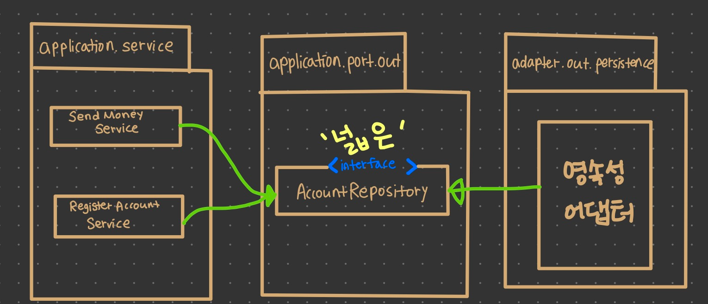

영속성 계층에 대한 의존성을 역전시키기 위해 영속성 계층을 애플리케이션 계층의 플러그인으로 만드는 방법을 살펴보는 챕터이다. 

# 의존성 역전


# 영속성 어댑터의 책임

1. 입력을 받는다. → 입력모델은 포트가 지정한 도메인 엔티티나 특정 데이터베이스 연산 적용 객체
2. 입력을 데이터베이스 포맷으로 매핑한다. → JPA경우 JPA엔티티 객체로
3. 입력을 데이터베이스로 보낸다.
4. 데이터베이스 출력을 애플리케이션 포맷으로 맵핑한다. 
5. 출력을 반환한다. 

핵심  - 영속성 어댑터의 입력 모델이 영속성 어댑터 내부에 있는 것이 아니라 애플리케이션 코어에 있기 때문에 영속성 어댑터 내부를 변경하는 것이 코어에 영향을 미치지 않는다

# 포트 인터페이스 나누기



🔝 특정 엔티티가 필요로 하는 모든 데이터베이스 연산을 하나의 리포지토리 인터페이스에 넣어 두는게 일반적인 이 방법은 하나의 넓은 포트 인터페이스에 의존성을 갖게한다. 

해결 방법은 인터페이스 분리 원칙 (ISP)


🔝  ISP를 적용하면 불필요한 의존성을 젝하고 기존 의존성을 눈에 더 잘띄게 만들 수 있다. 

# 영속성 어댑터 나누기


🔝  영속성 연산이 필요한 도메인 클래스 하나당 하나의 영속성 어댑터를 구현하는 방식

영속성 어댑터들은 각 영속성 기능을 이용하는 도메인 경계를 따라 자동으로 나누어 진다. 

도메인 코드는 영속성 포트에 의해 정의된 명세를 어떤 클래스가 충족시키는지에 관심이 없다.


이 접근 방식은 또한 여러개의 바운디드 컨텍스트의 영속성 요구사항을 분리하기 위한 좋은 토대

# 스프링 데이터 JPA 예제


여기서 Account와 Activity 도메인 모델, AccountJpaEntity와 ActivityJpaEntity 데이터 베이스 모델 간에 양방향 매핑이 존재

그냥 Account와 Activity 클래스를 그대로 데이터베이스에 엔티티로 저장하게 된다면 영속성 측면과 타협없이 풍부한 도메인 모델을 생성할 수 없게 되기 때문

# 데이터베이스 트랜잭션은 어떻게 해야 할까?

트랜잭션 경계는 어디에 위치? 

트랜잭션은 하나의 특정한 유스케이스에 대해서 일어나는 모든 쓰기 작업에 걸쳐있어야 한다. 

자바와 스프링에서는 @Transactional 애너테이션을 애플리케이션 서비스 클래스에 부여서 스프링이 모든 public 메서드를 트랜잭션을 감싸게 하는 것이다.

```java
package buckpal.application.service;

@Transactional
public class SendMoneSrvice implements SendMoneyUseCase {
  ... 
}
```

만약 서비스가 @transactional 에너테이션으로 오염되지 않고 깔끔하게 유지되길 원한 다면 AspectJ 같은 도구를 이용해 AOP으로 트랜잭션 경계를 코드에 위빙할 수 있다. 

public 이외에 메서드에 트랜잭션을 AspectJ를 사용해서 처리할 수 있다. 

```java
aspect TransactionManagementAspect {
    private TransactionManager transactionManager;

    pointcut transactionalOp() : ...

    Object around() : transactionalOp() {
        TransactionAttribute ta = ...
        TransactionStatus ts = transactionManager.getTransaction(ta);
        try {
            Object ret = proceed();
            transactionManager.commit(ts);
            return ret;
        } catch (Throwable ex) {
            if(ta.rollbackOn(ex)) {
                transactionManager.rollback(ts);
            } else {
                transactionManager.commit(ts);
            }
            throw ex;
        }
    }

    ...
}

https://livebook.manning.com/book/aspectj-in-action-second-edition/chapter-14/22
```

# 유지보수 가능한 소프트웨어를 만드는 데 어떻게 도움이 될까?

- 풍부한 도메인 모델
- 포트마다 다른 방식으로 구현할 수 있는 유연함
- 포트의 명세만 지키면 영속성 계층 전체를 교체할 수 있음