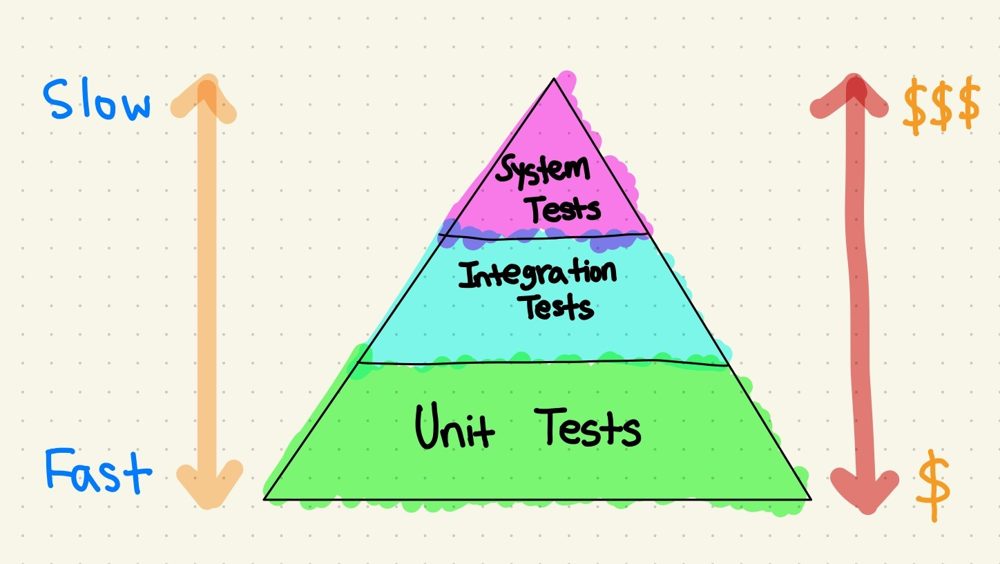
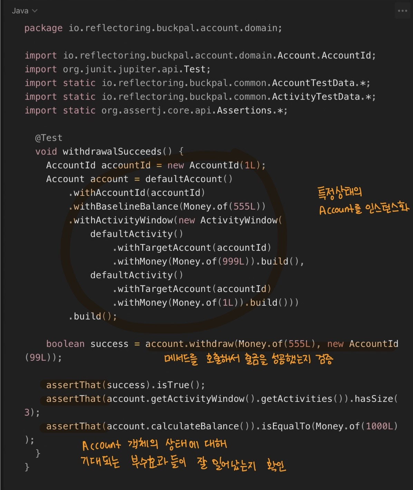
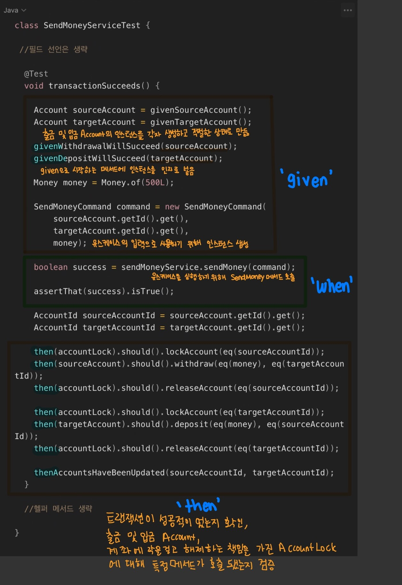
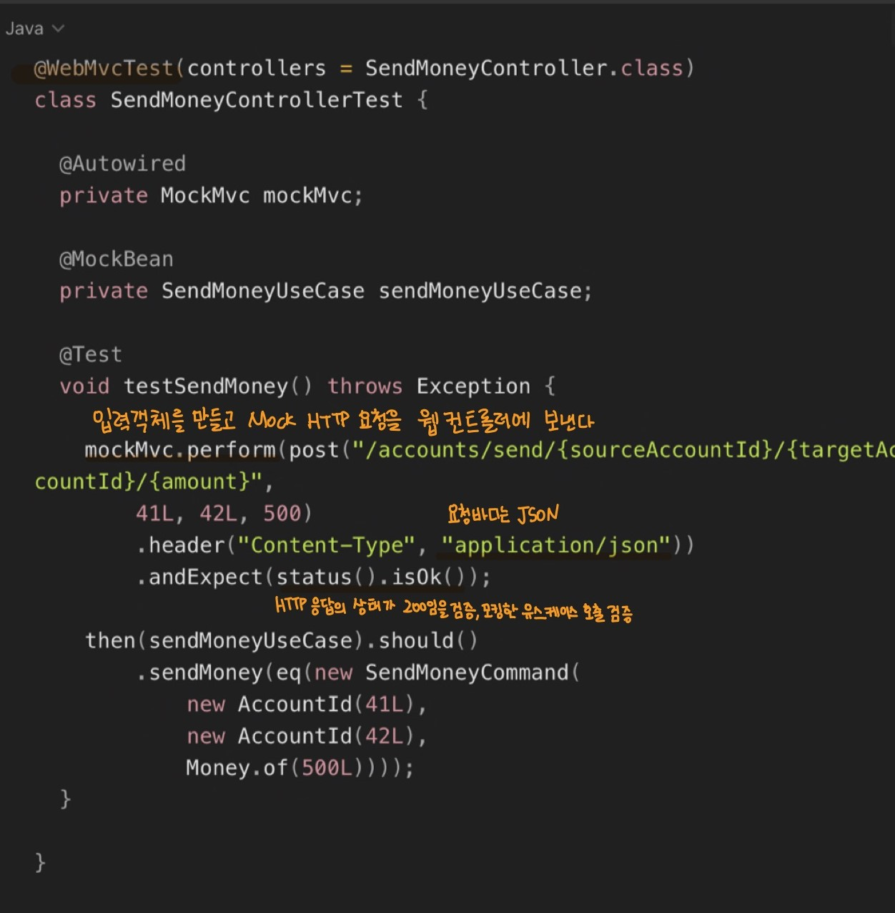
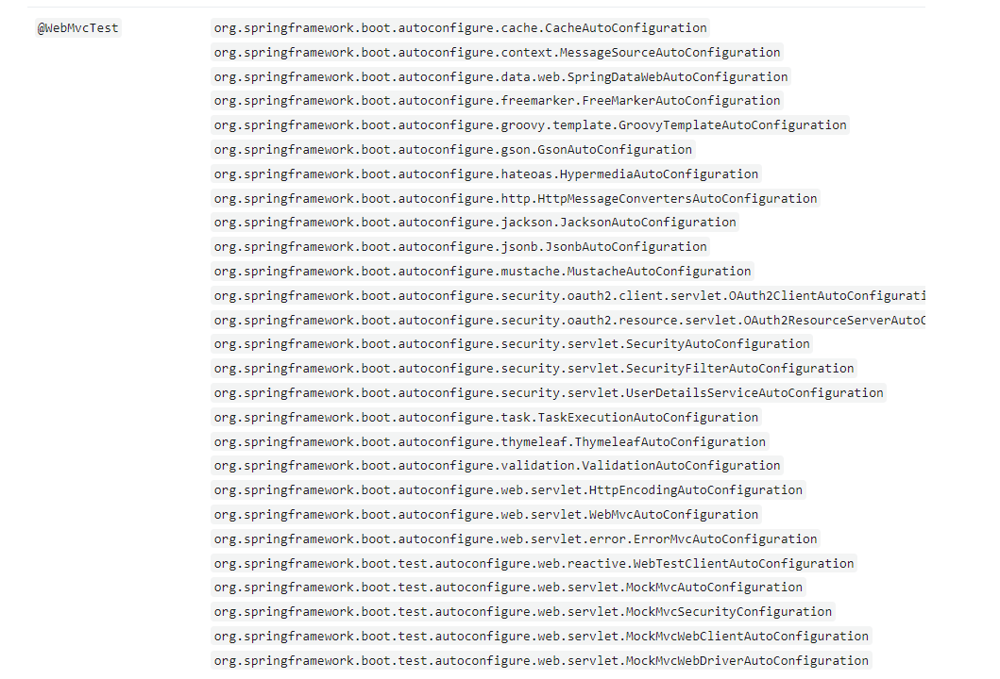
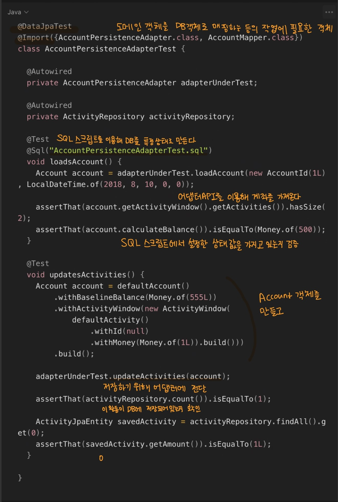
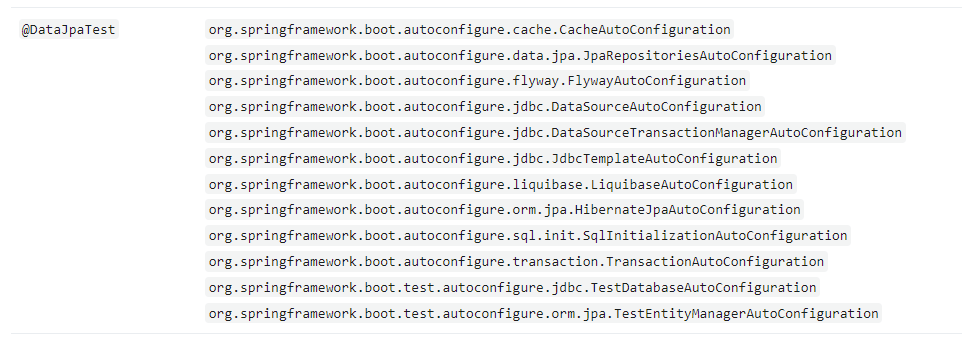
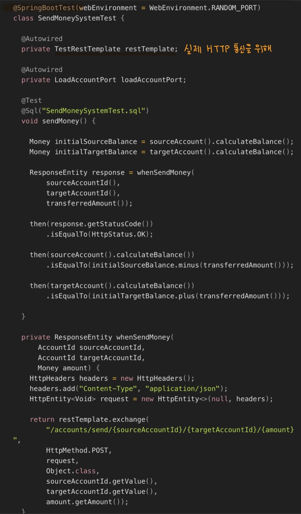
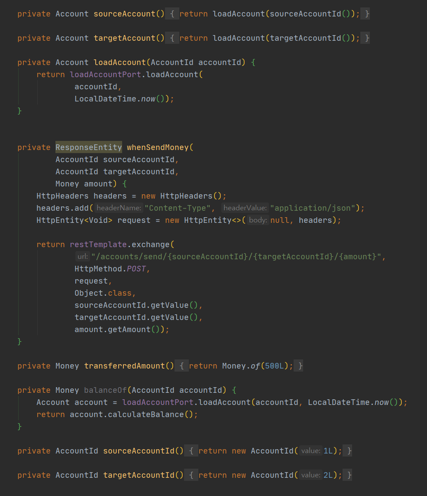

# Chapter 7. 아키텍처 요소 테스트하기

## 테스트 피라미드



- 단위 테스트 : 피라미드의 토대, 하나의 클래스를 인스턴스화하고 해당 클래스의 인터페이스를 통해 기능등을 테스트
- 통합 테스트 : 연결된 여러 유닛을 인스턴스화하고 시작점이 되는 클래스의 인터페이스로 데이터를 보낸 후 유닛들의 네트워크가 기대한 대로 잘 동작하는지 검증
- 시스템 테스트 : 애플리케이션을 구성하는 모든 객체 네트워크를 가동시켜 특정 유스케이스가 전 계층에서 잘 동작하는지 검증

## 단위 테스트로 도메인 엔티티 테스트하기

<aside>
🕹️ 기대 하는 동작

</aside>

- Account의 상태 - 과거의 특정 시점의 계좌 잔고(baselineBalance)  + 입출금 내역(activity)
- withdarw() 메서드 작동

 



## 단위 테스트로 유스케이스 테스트하기

<aside>
🕹️ 기대하는 동작

</aside>

- 출금 계좌의 잔고가 다른 트랜잭션에 의해 변경되지 않도록 lock
- 출금 계좌에서 돈이 출금되고 나면 똑같이 입금 계좌에 락을 걸고 돈을 입금
- 두 계좌에서 모두 락을 해제한다.



이 테스트는 서비스가 모킹된 의존 대상 (ex AccountLock)의 특정 메서드(ex lockAccount())와 상호작용 했는지 여부를 검증한다. 이건 테스트가 코드의 행동 변경 뿐만 아니라 코드의 구조 변경에도 취약해진다. 

```java
public interface AccountLock {
	void lockAccount(Account.AccountId accountId);
	void releaseAccount(Account.AccountId accountId);
}
```

모든 동작을 검증하는 대신 중요한 핵심만 골라 집중해서 테스트 하는 것이 좋다 

## 통합 테스트로 웹 어댑터 테스트하기

<aside>
🕹️ 기대하는 동작

</aside>

- JSON 문자열 등의 형태로 HTTP를 통해 입력을 받고
- 입력에 대한 유효성 검증을 하고
- 유스케이스에서 사용할 수 있는 포맷으로 맵핑하고
- 유스케이스에 전달
- 결과를 JSON으로 매핑하고
- HTTP응답을 통해 클라이언트에 반환
    
    
    


    

## 통합 테스트로 영속성 어댑터 테스트하기

<aside>
🕹️ 기대하는 동작

</aside>

- 어댑터의 로직
- 데이터베이스 맵핑



    

데이터 베이스를 모킹하지 않는다! 

왜냐하면 모킹한 데이터베이스로 테스트 할 경우 실제 데이터베이스와 연동했을 때 SQL 구문의 오류나 데이터베이스 테이브과 자바 객체 간의 매핑 에러 등으로 문제가 생길 확률이 높고 

인메모리 데이터베이스를 사용하는 경우 테이터베이스마다 고유한 SQL문법이 있어서 생기는 문제 등 프로덕션 환경에서 문제가 생길 가능성이 높다. 

## 시스템 테스트로 주요 경로 테스트하기

<aside>
🕹️ 기대하는 동작

</aside>

- 애플리케이션에 HTTP 요청 보내고
- 계좌의 잔고를 확인하는 것



테스트 가독성을 높이기 위해 지저분한 로직들은 헬퍼 메서드 안으로 감췄다👇

이 헬퍼 메서드들은 여러가지 상태를 검증할때 사용할 수 있는 도메인 특화 언어(DSL)를 형성한다. 



## 얼마만큼의 테스트가 충분할까?

얼마나 마음 편하게 소프트웨어를 배포할 수 있는냐를 테스트의 성공 기준으로 삼으면 된다

처음 몇번의 배포에는 믿음의 도약이 필요하지만 프로덕션의 **버그를 수정하고 이로부터 배우는 것**을 우선 순위로 삼으면 제대로 가고 있는 것이다.

다음은 육각현 아키텍처에서 사용하는 테스트를 정의하는 전략이다. 

- 도메인 엔티티를 구현할 때는 단위 테스트로 커버하자
- 유스케이스를 구현할 때는 단위 테스트로 커버하자
- 어댑터를 구현할 때는 통합 테스트로 커버하자
- 사용자가 취할 수 있는 중요 애플리케이션 경로는 시스템 테스트로 커버하자

## 유지보수 가능한 소프트웨어를 만드는 데 어떻게 도움이 될까?

**육각형 아키텍처**는 도메인 로직과 바깥으로 향한 어댑터를 깔끔하게 분리하다. 덕분에 핵심 도메인 로직은 단위 테스트로, 어댑터는 통합 테스트로 처리하는 명확한 테스트 전략을 정의할 수 있다. 

테스트는 아키텍처의 문제에 대해 경고하고 유지보수 가능한 코드를 만들기 위한 올바른 길로 인도하는 카나리아의 역할도 한다고 할 수 있다.