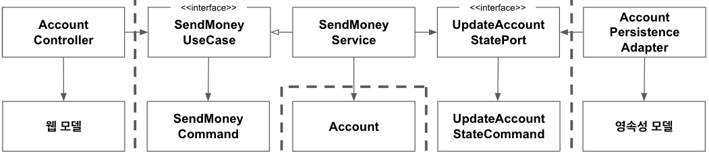

각 계층의 모델을 매핑하는 것에 다루어보자. 매퍼 구현을 피하기 위해 두 계층에서 같은 모델을 사용하는 것에 대해 논의해본 적이 있을 것이다.

아마 논쟁은 이런 식으로 진행됐을 것이다.

##### 매핑에 찬성하는 개발자:

두 계층 간에 매핑을 하지 않으면 양 계층에서 같은 모델을 사용해야 하는데 이렇게 하면 두 계층이 강하게 결합됩니다.

##### 매핑에 반대하는 개발자:

하지만 두 계층 간에 매핑을 하게 되면 보일러플레이트 코드를 너무 많이 만들게 돼요. 많은 유스케이스들이 오직 CRUD만 수행하고 계층에 걸쳐 같은 모델을 사용하기 때문에 계층 사이의 매핑은 과합니다.

몇 가지 매핑 전략을 장단점과 함께 알아보자.

## '매핑하지 않기' 전략

> 포트 인터페이스가 도메인 모델을 입출력 모델로 사용하면 두 계층 간의 매핑을 할 필요가 없다.

웹 계층에서는 웹 컨트롤러가 SendMoneyUseCase 인터페이스를 호출해서 유스케이스를 실행한다. 이 인터페이스는 Account 객체를 인자로 가진다. 즉 웹 계층과 애플리케이션 계층 모두 Account 클래스에 접근해야 한다는 것(두 계층이 같은 모델을 사용)을 의미한다.

도메인과 애플리케이션 계층은 웹이나 영속성 관련된 특수한 요구사항에 관심이 없음에도 불구하고 Account 도메인 클래스는 모든 요구사항을 다뤄야 한다. 이럴 때 웹 계층과 영속성 계층은 모델에 대해 특별한 요구사항이 있을 수 있다. (어노테이션 같은)

Account 클래스는 웹, 애플리케이션, 영속성 계층과 관련된 이유로 인해 변경돼야 하기 때문에 **단일 책임 원칙**을 위반한다.

기술적인 요구사항이 아니더라도, 각 계층이 Account 클래스에 특정 커스텀 필드를 두도록 요구할 수 있다. 그 결과, 오로지 한 계층에서만 필요한 필드들을 포함하는 파편화된 도메인 모델로 이어질 수 있다.

그렇다면 '매핑하지 않기'를 절대로 쓰며녀 안될까? 지저분하게 느껴질 수는 있지만 '매핑하지 않기' 전략이 딱 들어맞을 때가 있다.

간단한 CRUD 유스케이스를 생각해보자. 같은 필드를 가진 웹 모델을 도메인 모델로, 혹은 도메인 모델을 영속성 모델로 매핑할 필요가 있을까? 그럴 필요는 없다.

모든 계층이 정확히 같은 구조의, 정확히 같은 정보를 필요로 한다면 '매핑하지 않기' 전략은 완벽한 선택지다.

## '양방향' 매핑 전략

각 계층이 전용 모델을 가진 매핑 전략을 '양방향(Two-Way)' 매핑 전략이라고 한다.

> 각 어댑터가 전용 모델을 가지고 있어서 해당 모델을 도메인 모델로, 도메인 모델을 해당 모델로 매핑할 책임을 가지고 있다.

각 계층은 도메인 모델과는 완전히 다른 구조의 전용 모델을 가지고 있다.

웹 계층에서는 웹 모델을 인커밍 포트에서 필요한 도메인 모델로 매핑하고, 인커밍 포트에 의해 반환된 도메인 객체를 다시 웹 모델로 매핑한다.

영속성 계층은 아웃고잉 포트가 사용하는 도메인 모델과 영속성 모델 간의 매핑과 유사한 매핑을 담당한다.

두 계층 모두 양방향으로 매핑하기 때문에 '양방향' 매핑이라고 부른다.

각 계층이 전용 모델을 가지고 있는 덕분에 각 계층이 전용 모델을 변경하도라도 다른 계층에는 영향이 없다. 그래서 웹 모델은 데이터에 최적으로 표현할 수 있는 구조를 가질 수 있고, 도메인 모델은 유스케이스를 제일 잘 구현할 수 있는 구조, 영속성 모델은 데이터베이스에 객체를 저장하기 위해 ORM에서 필요로 하는 구조를 가질 수 있다.

이 매핑 전략은 웹이나 영속성 관심사로 오염되지 않은 깨끗한 도메인 모델로 이어진다. 즉 **단일 책임 원칙**을 만족하는 것이다.

'양방향' 매핑의 또 다른 장점은 개념적으로는 '매핑하지 않기' 전략 다음으로 간단한 전략이라는 것이다. 매핑 책임이 명확히다. 즉, 바깥쪽 계층/어댑터는 안쪽 계층의 모델로 매핑하고, 다시 반대 방향으로 매핑한다. 안쪽 계층은 해당 계층의 모델만 알면 되고 매핑대신 도메인 로직에 집중할 수 있다.

단점도 있다.

먼저, 너무 많은 보일러플레이트 코드가 생긴다.

또 다른 단점은 도메인 모델이 계층 경계를 넘어서 통신하는 데 사용되고 있다는 것이다. 인커밍 포트와 아웃고잉 포트는 도메인 객체를 입력 파라미터와 반환값으로 사용한다. 도메인 모델은 도메인 모델의 필요에 의해서만 변경되는 것이 이상적이지만 바깥쪽 계층의 요구에 따른 변경에 취약해지는 것이다.

## '완전' 매핑 전략'

> 각 연산이 전용 모델을 필요로 하기 때문에 웹 어댑터와 애플리케이션 계층 각각이 자신의 전용 모델을 각 연산을 실행하는 데 필요한 모델로 매핑한다.

이 매핑 전략에서는 **각 연산마다** 별도의 입출력 모델을 사용한다. 계층 경계를 넘어 통신할 때 도메인 모델을 사용하는 대신 그림 8.3의 SendMoneyUseCase 포트의 입력 모델로 동작하는 SendMoneyCommand처럼 각 작업에 특화된 모델을 사용한다.

웹 계층은 입력을 애플리케이션 계층의 커맨드 객체로 매핑할 책임을 가지고 있다. 이러한 커맨드 객체는 애플리케이션 계층의 인터페이스를 해석할 여지 없이 명확하게 만들어 준다. 각 유스케이스는 전용 필드와 유효성 검증 로직을 가진 전용 커맨드를 가진다.

그리고 나서 애플리케이션 계층은 커맨드 객체를 유스케이스에 따라 도메인 모델을 변경하기 위해 필요한 무언가로 매핑할 책임을 가진다.

당연하겠지만 한 계층은 한 계층을 다른 여러 개의 커맨드로 매핑하는 데는 하나의 웹 모델과 도메인 모델 간의 매핑보다 더 많은 코드가 필요하다. 하지만 이렇게 매핑하면 여러 유스케이스의 요구사항을 함께 다뤄야 하는 매핑에 비해 구현하고 유지보수하기가 훨씬 쉽다.

또한 어떤 경우에는 연산의 입력 모델에 대해서만 이 매핑을 사용하고, 도메인 객체를 그대로 출력 모델을 사용하는 것도 좋다.

이처럼 매핑 전략은 여러 가지를 섞어쓸 수 있고, 섞어 써야만 한다. 어떤 매핑 전략도 모든 계층에 걸쳐 전역 규칙일 필요가 없다.

## '단방향' 매핑 전략

> 동일한 '상태' 인터페이스를 구현하는 도메인 모델과 어댑터 모델을 이용하면 각 계층은 다른 계층으로부터 온 객체를 단방향으로 매핑하기만 하면 된다.

이 전략에서는 모든 계층의 모델들이 같은 인터페이스를 구현한다. 이 인터페이스는 관련있는 특성에 대한 getter 메서드를 제공해서 도메인 모델의 상태를 캡슐화한다.

도메인 모델 자체는 풍부한 행동을 구현할 수 있고, 애플리케이션 계층 내의 서비스에서 이러한 행동에 접근할 수 있다. 도메인 객체를 바깥 계층으로 전달하고 싶으면 매핑 없이 할 수 있다. 왜냐하면 도메인 객체가 인커밍/아웃고잉 포트가 기대하는 대로 상태 인터페이스를 구현하고 있기 때문이다.

그러고 나면 바깥 계층에서는 상태 인터페이스를 이용할지, 전용 모델로 매핑해야 할지 결정할 수 있다. 행동을 변경하는 것이 상태 인터페이스에 의해 노출돼 있지 않기 때문에 실수로 도메인 객체의 상태를 변경하는 일은 발생하지 않는다.

바깥 계층에서 애플리케이션 계층으로 전달하는 객체들도 이 상태 인터페이스를 구현하고 있다.

이 전략에서 매핑 책임은 명호가하다. 만약 한 계층이 다른 계층으로부터 객체를 받으면 해당 계층에서 이용할 수 있도록 다른 무언가로 매핑하는 것이다. 그러므로 각 계층은 한 방향으로만 매핑한다.

하지만 매핑이 계층을 넘나들며 퍼져 있기 때문에 이 전략은 다른 전략에 비해 개념적으로 어렵다.

이 전략은 계층 간의 모델이 비슷할 때 가장 효과적이다. 예를 들어, 읽기 전용 연산의 경우 상태 인터페이스가 필요한 모든 정보를 제공하기 때문에 웹 계층에서 전용 모델로 매핑할 필요가 전혀 없다.

## 언제 어떤 매핑 전략을 사용할 것인가?

'그때그때 다르다'

각 매핑 전략이 저마다 장단점을 갖고 있기 때문에 여러 패턴을 섞어써야 한다. 패턴을 섞어쓰면 어수선해 보일 수 있지만 특정 작업에 최선의 패턴이 아님에도 그저 깔끔하게 느껴진다는 이유로 선택하면 무책임하다.

소프트웨어는 시간이 지나며 변화를 거듭하기 때문에, 어제는 최선이었던 전략이 오늘은 최선이 아닐 수 있다. 고정된 매핑 전략으로 계속 유지하기 보다는 빠르게 코드를 짤 수 있는 간단한 전략으로 시작해서 계층 간 결합을 떼어내는 데 도움이 되는 복잡한 전략으로 갈아타는 것도 괜찮은 방법이다.

언제 어떤 전략을 사용할지 결정하려면 팀 내에서 합의할 수 있는 가이드라인을 정해둬야 한다. 이 가이드라인은 어떤 상황에서 어떤 매핑 전략을 가장 먼저 택해야 하는가에 답할 수 있어야 한다. 또한 **왜** 해당 전략을 최우선으로 택해야 하는지도 설명할 수 있어야 한다. 그래야 그러한 근거들이 시간이 흐른 후에도 여전히 유효한지 평가할 수 있기 때문이다.

가이드라인을 성공적으로 적용하려면 개발자들의 머릿속에 이 가이드라인이 잘 담겨 있어야 한다. 그러므로 가이드라인은 팀 차원에서 지속적으로 논의하고 수정해야한다.

## 유지보수 가능한 소프트웨어를 만드는 데 어떻게 도움이 될까?

인커밍 포트와 아웃고잉 포트는 서로 다른 계층이 어떻게 통신해야 하는지를 정의한다. 여기에는 계층 사이에 매핑을 수행할지 여부와 어떤 매핑 전략을 선택할지가 포함된다.

각 유스케이스에 대해 좁은 포트를 사용하면 유스케이스마다 다른 매핑 전략을 사용할 수 있고, 다른 유스케이스에 영향을 미치지 않으면서 코드를 개선할 수 있기 때문에 특정 상황, 특정 시점에 최선의 전략을 선택할 수 있다.
